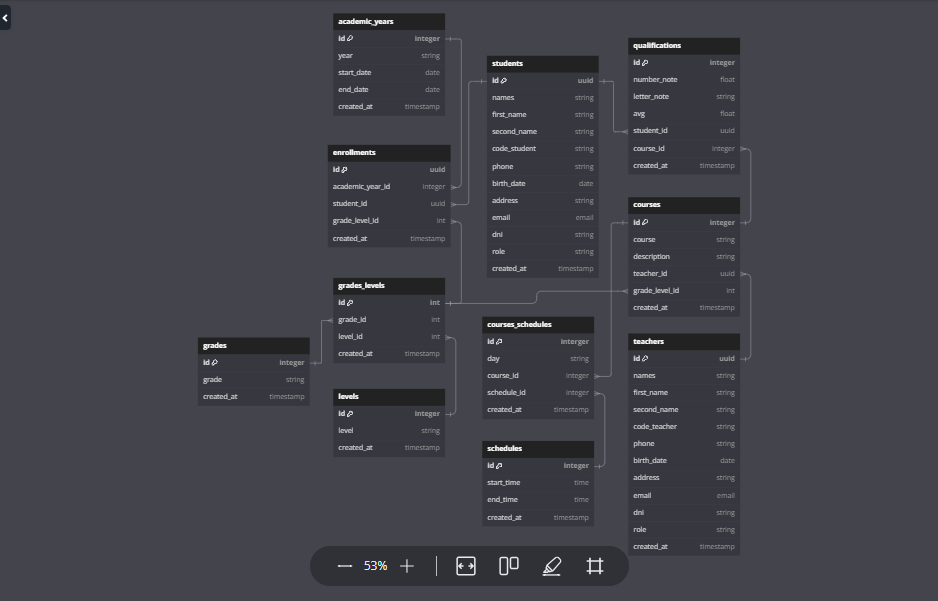

# api-school

project that aims to create an API that will be used to register students, teachers, courses and grades

## data base

The database contains tables of academic years, enrollments, levels, students, qualifications, teachers, courses, schedules,grades

## steps for starting project

:heavy_check_mark: install dependencies
`composer install`
:heavy_check_mark: configure the `.env` file based on the `.env.example` file
:heavy_check_mark: we configure the database, this project has the sqlite database by default; if we want to change to mysql, postgres, etc, we must make the change in the `.env` file
:heavy_check_mark: we run the migrations to obtain the tables needed for the project
`php artisan migrate`
:heavy_check_mark: we can run the seeders to get test data into our database and check their functionality.
`php artisan db:seed`
:heavy_check_mark: If we want to have an admin user, primary and secondary level as well as their respective grades, we must execute the following:
`php artisan db:seed --class=LevelsTableSeeder`
`php artisan db:seed --class=GradesTableSeeder`
:heavy_check_mark: in case you run the seeder and want to delete all the test data, run the following
`php artisan migrate:refresh`
:heavy_check_mark: initialize the server
`php artisan serve`
